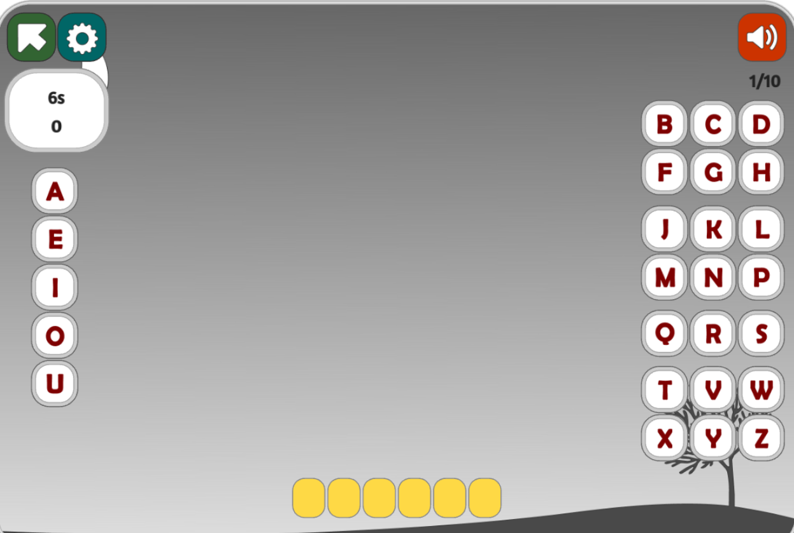
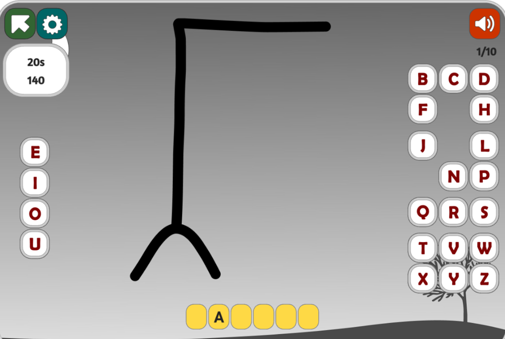
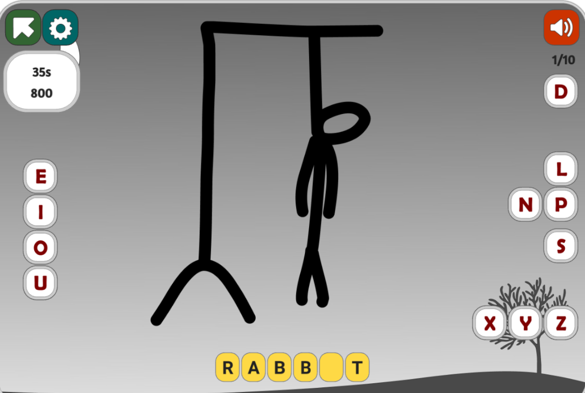

# Eighth Assignment Hang Man 🪢
## Introduction 👋
Welcome to your last assignment before the Final project. 🤠🤠  
I hope you all are still energetic and ready to continue your excellent work. In this project, you will build a Hangman game using JavaFX and store its data in a chosen database. 💻

## Prerequisites ✅
1) Make sure you have installed these apps before starting your project:

- SceneBuilder
- Mongodb/ PostgreSQL
- Java 21
- Git
- Gradle as a package manager 


## Objectives ✏️

By completing this assignment, you will:

- Learn about databases and how to work with them.
- Gain experience with JavaFX and UI development.


## Assignment Overview 🔎

Your task is to develop a Hangman game. Hangman is a game where the player must guess the word by suggesting letters within a limited number of guesses. Incorrect guesses result in a part of a stick figure being drawn, and the game is lost if the figure is completed before the word is guessed.

## How to Play Hangman

1. **Setup**:
   - One player (the host) thinks of a word and draws a series of blank spaces representing each letter of the word. For example, if the word is "APPLE", it would be shown as:
     ```
     _ _ _ _ _
     ```

2. **Gameplay**:
   - The other player (the guesser) suggests letters one at a time.
   - If the guessed letter is in the word, the host fills in the corresponding blanks with that letter, and the letter will be vanished from the keyboard.
   - If the guessed letter is not in the word, the host draws one part of a hangman figure. The typical order of drawing is:
     1. Head
     2. Body
     3. Left arm
     4. Right arm
     5. Left leg
     6. Right leg

3. **Winning and Losing**:
   - The guesser wins the game if they correctly guess all the letters in the word before the hangman figure is fully drawn.
   - The guesser loses the game if the hangman figure is completed before the word is guessed.

### Example with Steps

#### Step 1: Initial Setup
- The host thinks of the word "JAVA" and draws the blanks:
  ```
  _ _ _ _
  ```

#### Step 2: First Guess
- The guesser suggests the letter "A".
- The host fills in the blanks:
  ```
  _ A _ A
  ```
  No part of the hangman is drawn since the guess was correct.
  Letter A will be vanished from the keyboard.

#### Step 3: Second Guess
- The guesser suggests the letter "E".
- "E" is not in the word, so the host draws the head of the hangman.
  ```
  Drawing:
   O
  ```
  Word:
  ```
  _ A _ A
  ```

#### Step 4: Third Guess
- The guesser suggests the letter "J".
- The host fills in the blanks:
  ```
  J A _ A
  ```
  No additional part of the hangman is drawn.

#### Step 5: Fourth Guess
- The guesser suggests the letter "V".
- The host fills in the blanks:
  ```
  J A V A
  ```
  The word is fully guessed, and the guesser wins!

#### Final Drawing if the Guesser Loses:
If the guesser makes six incorrect guesses, the hangman figure is fully drawn, and the word is not guessed:
```
   ____
  |    |
  O    |
 /|\   |
 / \   |
       |
  =====
```

### Visual Representation

1. **Initial Setup**:

   

2. **Correct Guess**:

   

3. **Incorrect Guess**:

   

4. **Complete Hangman**:

   


## Tasks 📝

1. Fork this repository and clone it to your local machine.
2. Create a new branch named `develop` and switch to it. All development should be done in this branch.
3. Implement your Hangman game code. The following sections detail what needs to be done.
4. Create a video demonstrating your code (and even better, explaining its functionality). You can both submit this video to your TAs or push it in your repository. Your video should be about 1 or 2 minuets.


## DataBase Features ⛁
This project will utilize 3 Table:
1) Implement a Table for `UserInfo`
   When a user wants to start the game,
   they must add their information. 
   After signing up their information should be saved in the database.
    <pre>
    --Name--|--Username--|--Password--
            |            |
                 </pre>
    ```NOTE``` :: Make sure each username is different from others.


2) Implement Table for ``Score``       
   In the score part you should create 2 tables::
   1) First, you should create a table that contains the `users score`.
   This table is only visible to the user not the others.
   <pre>
    --Race--|--Trial & Error--|--Win--
            |                 |
   </pre>
    ``Race``: This column shows how many times the user has played this game.
    
   ``Trial & Error``: It indicates the number of incorrect attempts the user made before reaching the correct answer or losing the game.

   ``Win``: It should use a boolean operator
    (T for true if the user won , F for false if the user lost).
        
   2) Second, you should create a table for the `Global Score` ,
   which all users can see in their Global Score.
   <pre>
   --Username--|--Count--|--Win--|--Total Score--
               |         |       |
   </pre>
   ```Note```: The table should be sorted from higher total score to lower score.

    `Username`: It should store all usernames.

    `Count`: It should count the number of times the user has played this game.

    `Win`:  It should count all the sections where the user won the game.

    `Total Score` : It should be the product of Count and Win.

## UI + Front Features 🎨
 * Design Login & Signup page.
 * In main page you should add 3 button ::
   1) Start the game.
   2) Viewing the user's score.
   3) Viewing the Global score.
 - For each wrong answer, display the next part of the stick figure.

 * Data should be randomly generated by using [Animals API](https://api-ninjas.com/api/animals).


## Evaluation 📃

Your submission will be evaluated based on the following criteria:

- Error-free compilation and execution of your code.
- Clean and visually appealing UI.
- Correct use and design of the database.


**Note: Usage of ChatGPT or any other AI generative model to complete any part of this assignment is strictly prohibited. Violation will result in a score of 0 without warnings.**

## Bonus Objectives ✒️
- Add different difficulty levels to your game.
- Add other categories (e.g., cities, food) to your game.
- Enhance the UI design.
- Add a timer.
- Implement a competitive mode with two players playing simultaneously.

## Submission ⌛
The deadline for submitting your code is ....

## Resources 📚
🔗 [Online Hangman game](https://www.gamestolearnenglish.com/hangman/)

🔗 [Install postgresql](https://www.postgresql.org/download/)

🔗 [Install Mongodb](https://www.mongodb.com/try/download/community
)

🔗 [Install scenebuilder]( https://gluonhq.com/products/scene-builder
)


